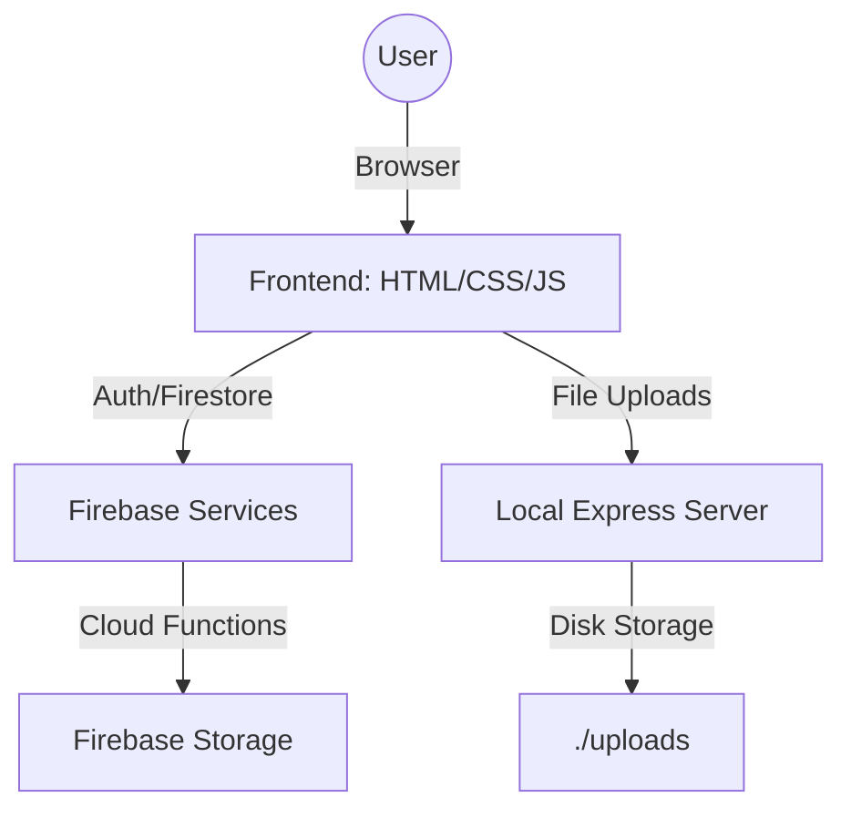

# WalkIn Architecture 🏗️

This document outlines the high-level architecture of the WalkIn platform.

## 1. System Overview

WalkIn is a multi-layered web application that combines client-side logic with Firebase services and a custom Node.js backend.

## 2. Frontend Layer

The frontend is built using vanilla web technologies to ensure maximum performance and accessibility.

- **State Management**: Handled locally via JavaScript modules and Firebase's real-time listeners.
- **Styling**: Uses a custom CSS design system with variables for consistent theming (colors, spacing, shadows).
- **Interactivity**: Extensive use of DOM manipulation for modals, tabs, and dynamic content rendering.

## 3. Backend & Data Layer

WalkIn uses a hybrid backend approach:

### A. Firebase (Primary)
- **Firestore**: Stores all structured data, including user profiles, job posts, applications, and success stories.
- **Authentication**: Handles user identity, signup, and login flows securely.
- **Cloud Functions**: Used for secure, server-side image processing and proxying uploads to Firebase Storage.

### B. Local Express Server (Optional/Secondary)
- **Purpose**: Primarily used for development or handling file uploads to the local file system.
- **Technology**: Built with Express and Multer for multipart form handling.
- **Storage**: Files are stored in the `/uploads` directory, organized by type (profile-images, application-docs).

## 4. Data Models (Firestore)

- **`users`**: Contains profile details, skills, and availability.
- **`posts`**: Stores job or service offerings with titles, descriptions, and prices.
- **`applications`**: Links users to posts, tracking the status of their interest.
- **`stories`**: Content for the success stories section.

## 5. Security

- **Client-Side**: Firebase Security Rules are implemented to ensure users can only modify their own data.
- **Server-Side**: Cloud Functions verify Firebase ID tokens before processing requests.
- **Uploads**: File types and sizes are validated both on the client and server.

---
For more details on specific implementations, please refer to the source code comments in `server.js` and `index.js`.
